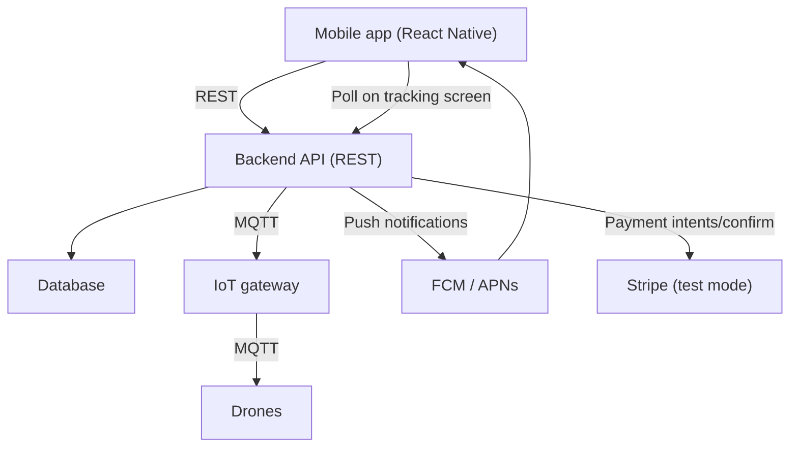

# Architecture

## System overview

A cross-platform mobile application (iOS and Android via React Native) that allows customers to browse products, place orders, and track drone deliveries in real time. The app communicates with a REST backend, which orchestrates order management, user data, and drone control. Drone communication is handled exclusively by an IoT gateway over MQTT. Payments are handled via Stripe in test mode for demo purposes.

---

## System diagram

---

## Component responsibilities

### Mobile app (React Native)

Responsible for all customer-facing UI: product browsing, ordering, order tracking, notifications, and profile management. Contains validation and local state, but main logic and decisions live in the backend. Polls the backend for drone position updates when the user is on the tracking screen. Receives order status notifications via FCM/APNs.

### Backend API (REST)

The single source of truth for all business logic. Handles authentication, product catalogue, order lifecycle, payment processing, and push notification dispatch. Translates order and delivery commands into MQTT messages for the IoT gateway. The app never communicates with the IoT gateway or database directly.

### Database

Persists all application data: users, products, orders, and delivery state. Only the backend has read/write access.

### IoT gateway

Responsible for all drone communication and control. Receives commands from the backend and relays telemetry (GPS position, battery, status) back via MQTT. Has no direct connection to the database or the mobile app.

### Stripe (test mode)

Handles payment processing. The backend creates payment intents and confirms payments via Stripe APIs before an order is confirmed. No real transactions occur — Stripe test mode card numbers are used throughout.

### FCM / APNs

Delivers push notifications to the mobile app for key order events (order confirmed, drone dispatched, delivery imminent, delivered). The backend triggers these events; FCM/APNs handles delivery to the device, including when the app is in the background or closed.

---

## Data flow

### Placing an order

1. Customer selects a product and initiates checkout in the app
2. App calls `POST /orders` on the backend
3. Backend creates a pending order in the database
4. App calls `POST /payments/intent` to retrieve the Stripe payment intent data
5. App completes payment using the Stripe SDK with the payment intent
6. App calls `POST /payments/confirm` to validate the payment and confirm the order
7. Backend marks the order as confirmed and dispatches a drone command via MQTT to the IoT gateway
8. Backend sends an "order confirmed" push notification via FCM/APNs to the customer's device

### Tracking a delivery

1. Customer opens the tracking screen in the app
2. App begins polling `GET /orders/:id/tracking` every 5–10 seconds
3. Backend reads the latest drone telemetry (position, status) stored from MQTT messages and returns it
4. App renders the drone position on a map
5. Polling stops when the customer leaves the tracking screen or the order status is "delivered"

### Push notifications

1. A delivery event occurs (drone dispatched, drone nearby, delivered)
2. IoT gateway publishes a telemetry or status update via MQTT to the backend
3. Backend processes the event, updates the order in the database, and sends a push notification via FCM/APNs
4. Customer receives the notification on their device regardless of whether the app is open

### Authentication

1. Customer registers or logs in via the app
2. App sends credentials to the backend
3. Backend validates and returns a token
4. App attaches the token to all subsequent API requests

---

## Key decisions & rationale

| Decision                                | Rationale                                                                                              |
| --------------------------------------- | ------------------------------------------------------------------------------------------------------ |
| React Native for mobile                 | Single codebase for iOS and Android; suitable for a demo project                                       |
| REST for frontend–backend communication | Simple, well-understood, sufficient for the use cases in this app                                      |
| Polling for drone tracking              | Simpler than WebSockets; acceptable latency for delivery tracking; can be upgraded later               |
| FCM/APNs for notifications              | Only viable option for background push on iOS and Android; decoupled from the API protocol             |
| MQTT for IoT gateway                    | Industry standard for IoT device communication; lightweight and well-suited for drone telemetry        |
| Stripe test mode for payments           | Provides a realistic, end-to-end payment integration without real transactions; appropriate for a demo |
| Backend as sole gateway to IoT          | Keeps drone control centralised and auditable; the app never sends commands to drones directly         |

---

## Open questions

- [ ] **Backend language and framework** — not yet decided. Consider Node.js (fast to develop, large ecosystem) or Python/FastAPI (clean async support, good MQTT libraries)
- [ ] **Database** — not yet decided. PostgreSQL is recommended given the relational nature of orders, products, and users. MongoDB is an option if schema flexibility is preferred early on
- [ ] **Authentication strategy** — not yet decided. JWT (self-managed) is the simplest; Auth0 or Clerk reduces implementation effort if time is a constraint
- [ ] **Hosting** — not yet decided. AWS, GCP, and Azure all support MQTT-capable backends. Consider a managed option (e.g. Railway, Render, or Fly.io) for lower ops overhead during the demo phase
- [ ] **Drone telemetry storage** — decide whether to persist full telemetry history in the database or only the latest known position. Persisting history enables replay and audit; latest-only is simpler
- [ ] **Tracking poll interval** — 5–10 seconds is assumed; confirm based on how frequently the IoT gateway publishes drone position updates

---

## Patterns to avoid

- The mobile app must never communicate directly with the IoT gateway or the database
- Business logic (order validation, payment confirmation, drone dispatch) must not live in the app — keep it in the backend
- User submitted data should be validated before submitted to the backend
- Do not send drone commands from the backend without a confirmed payment webhook from Stripe
- Do not expose raw MQTT telemetry to the frontend — always transform it into a clean API response
